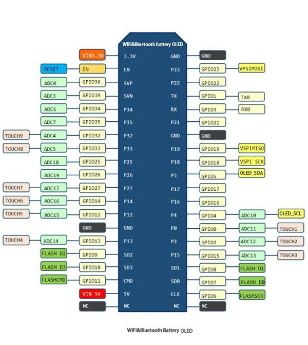
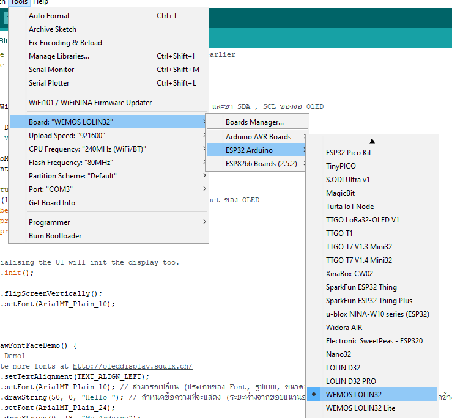
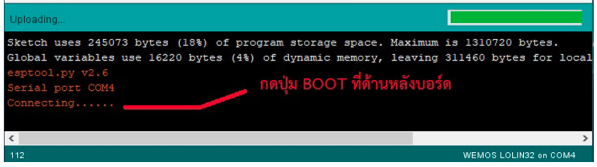

# TTGO ESP32 WiFi bluetooth 18650 Battery 0 96 inch OLED
  
 OLED ต่างจากบอร์ด ESP32 อื่นๆ ที่มี OLED, พิน I2C SDA และ SCL ของ OLED เชื่อมต่อกันดังนี้  
 SCL - Pin 4  
 SDA - Pin 5  
 

  
  
  
  

